# Laboratório 02 — Escalonamento de CPU

Kássio Barros Bastos  
Sistemas Operacionais — UNIFADESA

## Simulação

Foi utilizada a carga de processos do roteiro:

| Processo | Chegada | Duração |
|---|---:|---:|
| P1 | 0 ms | 8 ms |
| P2 | 1 ms | 4 ms |
| P3 | 2 ms | 9 ms |
| P4 | 3 ms | 5 ms |

Para executar:

```bash
python simulador_escalonador.py
```

O programa mostra os resultados no terminal e salva uma cópia em `resultados.txt`. Os diagramas estão neste README e são renderizados pelo GitHub. A simulação não acrescenta tempo às trocas de contexto. A prioridade da tabela do roteiro não é usada nesses algoritmos.

Os números no eixo dos diagramas representam milissegundos da simulação. O Mermaid utiliza internamente uma escala de segundos para desenhar o Gantt; cada segundo dessa escala corresponde a 1 ms simulado. Isso não altera os cálculos.

## 1. Efeito comboio

```mermaid
gantt
    title FCFS — tempo simulado em ms
    dateFormat X
    axisFormat %S
    section P1
    Executa de 0 a 8 ms :t1, 0, 8s
    section P2
    Espera de 7 ms :crit, espera, 1, 7s
    Executa de 8 a 12 ms :t2, 8, 4s
    section P3
    Executa de 12 a 21 ms :t3, 12, 9s
    section P4
    Executa de 21 a 26 ms :t4, 21, 5s
```



No FCFS, P1 começa em 0 ms e ocupa a CPU até 8 ms. P2 chega em 1 ms, mas precisa esperar P1 terminar. Assim, P2 espera 7 ms para executar uma tarefa de 4 ms.

A ordem de execução é P1, P2, P3 e P4. Esse é o efeito comboio: um processo longo ocupa a CPU enquanto os processos seguintes aguardam, inclusive os mais curtos.

| Processo | Finalização | Espera | Retorno |
|---|---:|---:|---:|
| P1 | 8 ms | 0 ms | 8 ms |
| P2 | 12 ms | 7 ms | 11 ms |
| P3 | 21 ms | 10 ms | 19 ms |
| P4 | 26 ms | 18 ms | 23 ms |

Espera média: (0 + 7 + 10 + 18) / 4 = **8,75 ms**.

Retorno médio: (8 + 11 + 19 + 23) / 4 = **15,25 ms**.

## 2. Variação do quantum

| Quantum | Trocas entre processos | Espera média | Retorno médio |
|---|---:|---:|---:|
| 1 ms | 23 | 12,50 ms | 19,00 ms |
| 3 ms | 9 | 13,50 ms | 20,00 ms |
| 50 ms | 3 | 8,75 ms | 15,25 ms |

Com quantum de 1 ms, os processos executam por intervalos menores e o número de trocas aumenta. P2 recebe a CPU pela primeira vez em 1 ms, enquanto no quantum de 3 ms começa em 3 ms. Isso permite uma resposta inicial mais rápida, mas em um sistema real também aumenta o trabalho de salvar e restaurar o contexto dos processos. Esse custo não foi incluído na simulação.

```mermaid
gantt
    title Round Robin — quantum 1 ms — tempo simulado em ms
    dateFormat X
    axisFormat %S
    section P1
    Executa de 0 a 1 ms :t1, 0, 1s
    Executa de 2 a 3 ms :t2, 2, 1s
    Executa de 6 a 7 ms :t3, 6, 1s
    Executa de 10 a 11 ms :t4, 10, 1s
    Executa de 14 a 15 ms :t5, 14, 1s
    Executa de 17 a 18 ms :t6, 17, 1s
    Executa de 20 a 21 ms :t7, 20, 1s
    Executa de 22 a 23 ms :t8, 22, 1s
    section P2
    Executa de 1 a 2 ms :t9, 1, 1s
    Executa de 4 a 5 ms :t10, 4, 1s
    Executa de 8 a 9 ms :t11, 8, 1s
    Executa de 12 a 13 ms :t12, 12, 1s
    section P3
    Executa de 3 a 4 ms :t13, 3, 1s
    Executa de 7 a 8 ms :t14, 7, 1s
    Executa de 11 a 12 ms :t15, 11, 1s
    Executa de 15 a 16 ms :t16, 15, 1s
    Executa de 18 a 19 ms :t17, 18, 1s
    Executa de 21 a 22 ms :t18, 21, 1s
    Executa de 23 a 24 ms :t19, 23, 1s
    Executa de 24 a 25 ms :t20, 24, 1s
    Executa de 25 a 26 ms :t21, 25, 1s
    section P4
    Executa de 5 a 6 ms :t22, 5, 1s
    Executa de 9 a 10 ms :t23, 9, 1s
    Executa de 13 a 14 ms :t24, 13, 1s
    Executa de 16 a 17 ms :t25, 16, 1s
    Executa de 19 a 20 ms :t26, 19, 1s
```



Com quantum de 50 ms, todos os processos terminam antes de esgotar sua fatia de tempo. Por isso, a execução fica igual à do FCFS, com três trocas entre processos e as mesmas médias.

```mermaid
gantt
    title Round Robin — quantum 50 ms — tempo simulado em ms
    dateFormat X
    axisFormat %S
    section P1
    Executa de 0 a 8 ms :t1, 0, 8s
    section P2
    Executa de 8 a 12 ms :t2, 8, 4s
    section P3
    Executa de 12 a 21 ms :t3, 12, 9s
    section P4
    Executa de 21 a 26 ms :t4, 21, 5s
```



Na contagem, foi considerada troca a passagem da CPU de um processo para outro diferente. O despacho inicial e a saída final não foram contados. No quantum de 1 ms, P3 executa sozinho de 23 a 26 ms. Esses três intervalos pertencem ao mesmo processo e não representam trocas entre processos. Portanto, as 26 fatias de execução resultam em 23 trocas.

Para o quantum de 3 ms do roteiro, os resultados foram:

```mermaid
gantt
    title Round Robin — quantum 3 ms — tempo simulado em ms
    dateFormat X
    axisFormat %S
    section P1
    Executa de 0 a 3 ms :t1, 0, 3s
    Executa de 12 a 15 ms :t2, 12, 3s
    Executa de 21 a 23 ms :t3, 21, 2s
    section P2
    Executa de 3 a 6 ms :t4, 3, 3s
    Executa de 15 a 16 ms :t5, 15, 1s
    section P3
    Executa de 6 a 9 ms :t6, 6, 3s
    Executa de 16 a 19 ms :t7, 16, 3s
    Executa de 23 a 26 ms :t8, 23, 3s
    section P4
    Executa de 9 a 12 ms :t9, 9, 3s
    Executa de 19 a 21 ms :t10, 19, 2s
```



| Processo | Finalização | Espera | Retorno |
|---|---:|---:|---:|
| P1 | 23 ms | 15 ms | 23 ms |
| P2 | 16 ms | 11 ms | 15 ms |
| P3 | 26 ms | 15 ms | 24 ms |
| P4 | 21 ms | 13 ms | 18 ms |

Espera média: (15 + 11 + 15 + 13) / 4 = **13,50 ms**.

Retorno médio: (23 + 15 + 24 + 18) / 4 = **20,00 ms**.

## 3. Cálculo manual do SJF não preemptivo

Em 0 ms, apenas P1 está disponível. Ele executa até 8 ms, pois o algoritmo não interrompe um processo em execução.

Quando P1 termina, os outros três processos já chegaram. P2 tem a menor duração e executa de 8 a 12 ms. Depois, P4 executa de 12 a 17 ms e P3 de 17 a 26 ms.

A ordem é **P1 → P2 → P4 → P3**.

```mermaid
gantt
    title SJF não preemptivo — tempo simulado em ms
    dateFormat X
    axisFormat %S
    section P1
    Executa de 0 a 8 ms :t1, 0, 8s
    section P2
    Executa de 8 a 12 ms :t2, 8, 4s
    section P3
    Executa de 17 a 26 ms :t3, 17, 9s
    section P4
    Executa de 12 a 17 ms :t4, 12, 5s
```



O retorno é calculado por finalização menos chegada. A espera é o retorno menos a duração. Neste caso, como não há interrupções, também é possível calcular a espera por início menos chegada.

| Processo | Início | Finalização | Espera | Retorno |
|---|---:|---:|---:|---:|
| P1 | 0 | 8 | 0 − 0 = 0 | 8 − 0 = 8 |
| P2 | 8 | 12 | 8 − 1 = 7 | 12 − 1 = 11 |
| P4 | 12 | 17 | 12 − 3 = 9 | 17 − 3 = 14 |
| P3 | 17 | 26 | 17 − 2 = 15 | 26 − 2 = 24 |

Valores em milissegundos.

Espera média: (0 + 7 + 9 + 15) / 4 = **7,75 ms**.

Retorno médio: (8 + 11 + 14 + 24) / 4 = **14,25 ms**.

| Algoritmo | Espera média | Retorno médio |
|---|---:|---:|
| FCFS | 8,75 ms | 15,25 ms |
| Round Robin — quantum de 3 ms | 13,50 ms | 20,00 ms |
| SJF não preemptivo | 7,75 ms | 14,25 ms |

O SJF apresentou as menores médias nessa carga. Em comparação com FCFS, P4 passou a esperar 9 ms em vez de 18 ms, enquanto a espera de P3 aumentou de 10 para 15 ms. A espera média caiu 1 ms.

P2 continuou esperando 7 ms no SJF porque P1 já estava executando. Escolher P2 primeiro, no instante 0, seria incorreto: ele só chega em 1 ms.

O Round Robin permitiu que os processos começassem a executar antes, mas com quantum de 3 ms apresentou médias de espera e retorno maiores. Portanto, oferecer uma resposta inicial mais rápida não significa terminar os processos mais cedo.
